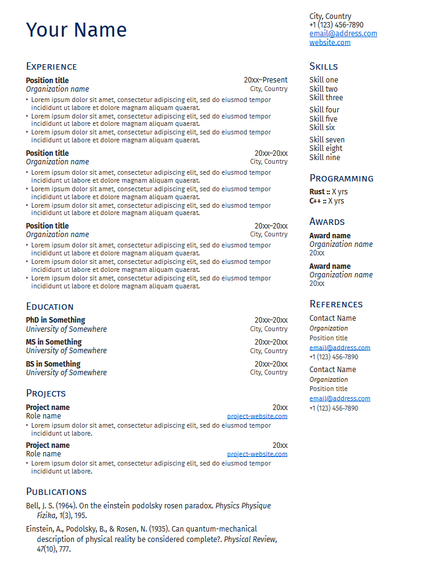

# Clean CV template for Typst

A [typst](https://typst.app/) template for a clean curriculum vitae or resume.

## Basic Usage

The easiest way to get started is to edit the template file. It contains examples of how to call each of the macros and fill them in with information.

### Filling columns

Content for each column is entered as normal within the `left_content` and `right_content` square-bracket `[]` contexts. See `templates/main.typ` for an example.

### Publication list

A list of publications can be displayed using the `#publications` macro. You must supply a BibLaTeX `.bib` or Hayagriva `.yml` file containing the references to be cited, and all entries will be displayed in the order in which they appear in the file .
